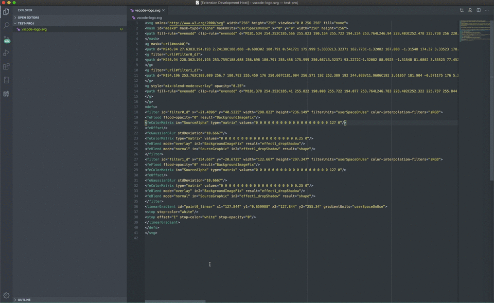
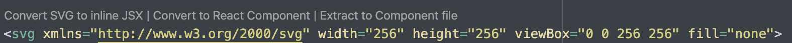
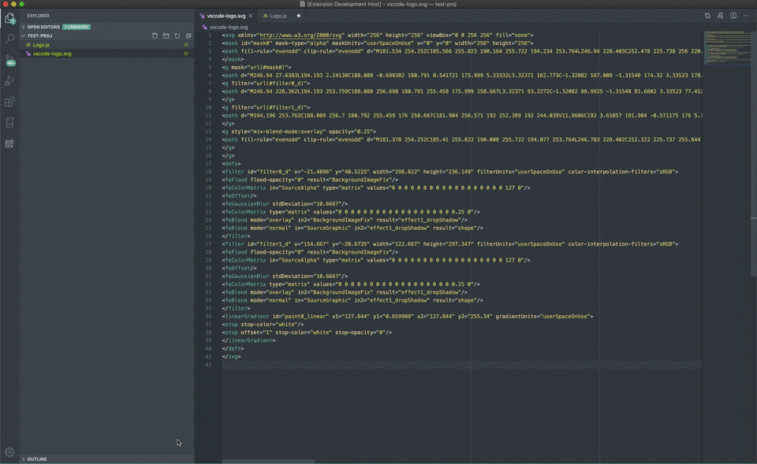
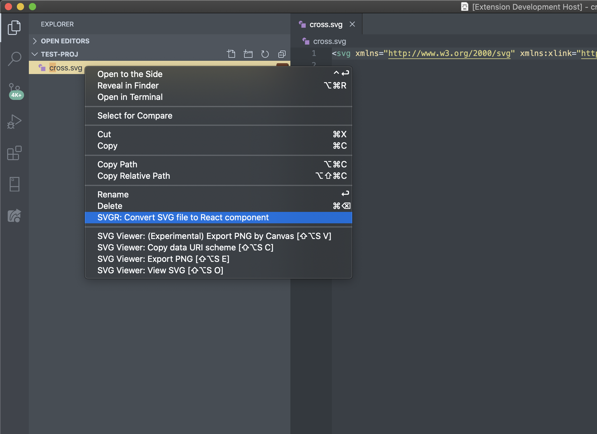

# SVGR: VS-Code Edition

This extension is a port of the SVGR library for use in Visual Studio Code. It allow's you to convert SVG's to JSX syntax for use in React JS (and React Native) using a variety of methods.

You can convert SVG to JSX using any of the following methods:

### Paste SVG into empty .js file

You can automatically convert an SVG to JSX by pasting the SVG code into an empty .js or .ts file":

### Convert SVG in .js file using Code Lens

When you have an inline SVG in an React file a series of links will appear above the SVG code. You can convert the
SVG to the following:

- Inline SVG code (JSX Formatted)
- A React Component in the same file
- A React Component in the a different dedicated file

Here is what Code Lens looks like:

You can convert your SVG to an component in the same file like so:

### Using right click to convert SVG file to Component file.

You can convert a .svg file to a React component file by right clicking on it and clicking on the button labeled:
"SVGR: Convert SVG file to React component"

